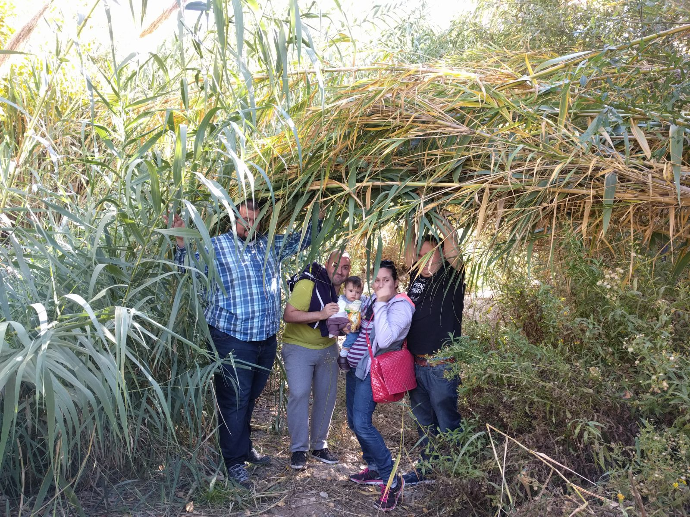

Title: Python como pegamento social - Parte 3  
Date: 2018-05-15 22:22  
Modified: 2018-05-15 22:22  
Category: Experiencias  
Tags: python, jamtoday, gestión de equipos  
Author: Cristóbal Contreras Rubio  

### ANTECEDENTES
Esta historia narra como [Python](https://python.org), un lenguaje de programación (eso que hablan los ordenadores) trasciende a la informática, y se convierte en una herramienta de cohesión social. Si, ya lo se, ¿que pasa con la parte I y II? Bueno esas irán luego, aunque siguen siendo anteriores a esta historia. Lo que  pasa es que he creado este blog justo después de todo lo que aquí voy a contar, y como autor de este lugar, me tomo ciertas licencias ¡¡¡Vamos al lío!!!

Todo comienza con una visita a una pareja de amigos, [Laura Cáceres](https://twitter.com/laucabel) y [Diego Martínez](https://twitter.com/guadatech). Ellos dos, junto a su compañero [Juan Manuel Sánchez](https://twitter.com/jmsafe), trabajan en los centros Guadalinfo de sus pueblos, enseñando tecnologías Open Source. Y como el entorno rural no se ciñe solo a sus casas, crearon la asociación [Guadatech](https://guadatech.com) para poder llevar esa pasión que tienen por toda la provincia de Almería. **La labor que hacen es brutal** y **siento una gran admiración por ellos y su trabajo**.

El caso es que hablando con Diego, me comentó que a Juanma y él se les *había calentado el hocico*, y estaban preparando llevar varios equipos del Guadalinfo a la [JamToday](http://www.jamtodayalmeria.com/) (un hackaton sobre videojuegos con temática social). Normalmente Diego enseña [Scratch](https://scratch.mit.edu/) (otro lenguaje más simple que Python) a los niños para empezar, pero uno de los equipos de su pueblo, Sorbas, los quería llevar en la categoría de Python. ¿Y que problema hay entonces? Pues que para la competición quedaban escasamente seis semanas, el equipo estaba formando en su mayoría por menores que nunca habían aprendido Python (no es un lenguaje complejo, pero 6 semanas es muy poco) y los chavales no estaban del todo motivados. Encantado le ofrecí mi mano y Diego tomó mi brazo (cosa que agradezco).  

### PREPARACIÓN
Durante cinco semanas estuve yendo un día por semana a Sorbas, que se encuentra a unos 70km de Almería capital. Diego tenía ya muy pensando que debían seguir un [temario muy apañado](http://programarcadegames.com/index.php?lang=es) que habían encontrado, basado en [Pygame](https://www.pygame.org/news). Como yo estaba para aportar, eso hicimos pero fui añadiendo mi granito de arena los días que iba. Los demás días era Diego quien los guiaba. Así que el equipo Python Junior Sorbas estuvo "currando" 5 meses a 1-3 sesiones de 2h por semana. El equipo era muy heterogéneo y dispar, compuesto por:

- Pablo, 6º de EGB ~ 11-12 años.
- Iona, 6º de EGB ~ 11-12 años.
- Eve, 3º de la ESO ~ 14-15 años.
- Sami, 1º de Bachiller Tecnológico ~ 16-17 años.
- Diego (se llama igual que el otro Diego), desempleado ~ 35 años.

<blockquote class="twitter-tweet" data-lang="es">
El equipo de <a href="https://twitter.com/hashtag/python?src=hash&amp;ref_src=twsrc%5Etfw">#python</a> junior del <a href="https://twitter.com/hashtag/guadalinfo?src=hash&amp;ref_src=twsrc%5Etfw">#guadalinfo</a> de <a href="https://twitter.com/hashtag/Sorbas?src=hash&amp;ref_src=twsrc%5Etfw">#Sorbas</a> concentrado siguiendo las explicaciones de <a href="https://twitter.com/CrisConRu?ref_src=twsrc%5Etfw">@CrisConRu</a> <a href="https://t.co/lXepl2iNVd">pic.twitter.com/lXepl2iNVd</a>
&mdash; guadalinfosorbas (@guada_sorbas) <a href="https://twitter.com/guada_sorbas/status/981410230763491328?ref_src=twsrc%5Etfw">4 de abril de 2018</a></blockquote>

Lo primero que hice fue centrarme en las herramientas. **Ningún miembro del equipo contaba con un ordenador propio**, así que **cogimos 5 portátiles de Guadatech y se los asignamos** para toda la aventura. Hay que decir que **los equipos eran bastante obsoletos** (ordenadores de 32 bits, con distribuciones Linux ligeras y que aun así les cuesta andar...).  

<b>Si me lee algún responsable político, ruego abastezcan los centro Guadalinfo con equipos decentes</b>.
  

Una vez teniamos máquinas, lo siguiente era usar un IDE/editor de texto amigable para que aprender algo tan nuevo y tan poco apetitoso, como es programar, les entrara bien en sus cuerpos. Estaban usando [Geany](https://www.geany.org/), un editor muy simple, pero que no contaba con autocompletado. Puede parecer una tontería, pero **para mi el autocompletado es básico**. No solo porque **programas más rápido**, sino porque **te ayuda a no equivocarte escribiendo**. La opción lógica era usar [Sublime Text](https://www.sublimetext.com/) por cuestiones de recursos-usabilidad, pero **somos defensores del Software Libre y tenemos que predicar con el ejemplo**, así que el elegido fue [Visual Studio Code](https://code.visualstudio.com/). Solo en su instalación, con la configuración de su [plugin de Python](https://marketplace.visualstudio.com/items?itemName=ms-python.python) y todo lo demás, se llevó una sesión (perder una sola sesión es un handicap brutal).  

<blockquote class="twitter-tweet" data-lang="es">
Ayer por la tarde en el taller de <a href="https://twitter.com/hashtag/python?src=hash&amp;ref_src=twsrc%5Etfw">#python</a> del <a href="https://twitter.com/hashtag/guadalinfo?src=hash&amp;ref_src=twsrc%5Etfw">#guadalinfo</a> de <a href="https://twitter.com/hashtag/Sorbas?src=hash&amp;ref_src=twsrc%5Etfw">#Sorbas</a> y <a href="https://twitter.com/hashtag/Uleila?src=hash&amp;ref_src=twsrc%5Etfw">#Uleila</a> recibimos la visita del programador profesional <a href="https://twitter.com/CrisConRu?ref_src=twsrc%5Etfw">@CrisConRu</a> que nos hablo de editores avanzados y metodologías de trabajo ágiles para prepararnos de cara a la <a href="https://twitter.com/jamtodayAND?ref_src=twsrc%5Etfw">@jamtodayAND</a> <a href="https://t.co/ktvempNLjm">pic.twitter.com/ktvempNLjm</a>
&mdash; guadalinfosorbas (@guada_sorbas) <a href="https://twitter.com/guada_sorbas/status/981409666583449601?ref_src=twsrc%5Etfw">4 de abril de 2018</a></blockquote>

Preparados ya para currar, y teniendo claro el camino, traté de suavizar más la subida al Everest que teníamos por delante. Le dije a Diego que quería aplicar Scrum con ellos. Lo cierto es que suena tan ampuloso que Diego se asustó, así que puse los pies en la tierra y me centré en "aplicar dinámicas de trabajo" con los chavales:

- Les expliqué todo lo que en teoría necesitamos para programar un juego, y en como el temario que seguíamos lo cubría (es decir, que entiendan que vamos a hacer y por qué).
- Luego fijamos cuantos temas teníamos que dar en cada sesión si queríamos llegar preparados.
- Fijabamos unos objetivos/tareas que había que cumplir para cada sesión siguiente.
- Diego les hacía que se corrigiesen las tareas unos a otros, gamificando además aquello reuniendo los resultados de los evaluadores y evaluados en una tabla visible para todos.
- Usamos tres sesiones puramente a Python.
- Las dos últimas nos centramos en fijar roles (ilustración, fx, música, etc) y familiarizarnos con las herramientas de cada rol.
- La última sesión (en la que no pude estar) fue un simulacro, trataron de hacer un juego partiendo de uno ya hecho.

<iframe width="560" height="315" src="https://www.youtube.com/embed/2Dxyi4s0xME" frameborder="0" allow="autoplay; encrypted-media" allowfullscreen></iframe>

<b>NOTA: Si has visto el video entero, yo no fumo, era solo una broma</b>

Fue difícil que los chavales se motivasen, tanto por el tiempo disponible como por los medios. Aun así, en los últimos años he descubierto que las relaciones interpersonales es de lo que menos mal se me está dando, luego había que dar rienda suelta a ¿mi talento? No podría dar un guión sobre como llevar un proceso de gestión de personas, cada ser humano es un mundo, pero resumiendo un poco:

- **"*No son tontos, solo son tienen menos edad*"** (frase de mi amigo [Adolfo Rosillo](https://twitter.com/outecran))
    - En todo momento les hablaba y trataba como adultos.
    - **Sin olvidar que son menores y hay que tener mano izquierda**.
    - Les hablaba mirándoles a los ojos, y les pedía que ellos hicieran lo mismo cuando me escuchaban.
- Generar compromiso
    - No les iba a regañar, si venían es porque querían, así que tenían que implicarse.
    - Les hice ver que yo no tenía ninguna necesidad de estar allí (de hecho me venía mal), solo estaba para ayudarles.
    - **Sin olvidar que son menores y hay que tener mano izquierda**.
- Las personas lo primero, lo demás después
    - Me preocupé en saber que les gustaba, que querían hacer.
    - Les expliqué como tenian que ayudarse entre ellos, porque si cualquiera falla, todo el equipo se resiente.
    - Inculcarles que **lo que haces/aprendes tienes que intentar que te guste**, ya sean las [clases](https://es.wikipedia.org/wiki/Clase_(inform%C3%A1tica)) en programación o la narrativa para el examen de lengua que hay dentro de dos días. Para ello es importante que le prestes atención.
    - **Sin olvidar que son menores y hay que tener mano izquierda**.
- Fuera complejos o soñar siendo "ambiciosos"
    - Vale, no somos ni los más guapos, ni los más altos, ni programamos mejor que nadie.
    - Pero les hice ver que un videojuego son muchas cosas (historia, dinámica, música, diversión...), no solo programar.
    - Precisamente por eso importa la multidisciplinariedad, el equipo, y podemos hacernos valer todos.
    - Así que humildad ante todo, pero si se sale al campo es a ganar, y no somos mancos.
    - **Sin olvidar que son menores y hay que tener mano izquierda**.

Diego como los conoce, y lleva ya tiempo con ellos, también les daba sesiones para crear piña de cara al evento (ojalá hubiera podido estar) ¡¡¡Que crack!!!

<blockquote class="twitter-tweet" data-lang="es">
La gasolina de los programadores para los jóvenes developers del <a href="https://twitter.com/hashtag/guadalinfo?src=hash&amp;ref_src=twsrc%5Etfw">#guadalinfo</a> de <a href="https://twitter.com/hashtag/Sorbas?src=hash&amp;ref_src=twsrc%5Etfw">#Sorbas</a>.  Compartiendo unas pizzas después de una tarde-noche intensa de programación en <a href="https://twitter.com/hashtag/python?src=hash&amp;ref_src=twsrc%5Etfw">#python</a>  preparándonos para la <a href="https://twitter.com/hashtag/jamtodayal3?src=hash&amp;ref_src=twsrc%5Etfw">#jamtodayal3</a> <a href="https://t.co/glSWmaXz8A">pic.twitter.com/glSWmaXz8A</a>
&mdash; guadalinfosorbas (@guada_sorbas) <a href="https://twitter.com/guada_sorbas/status/986551031176851457?ref_src=twsrc%5Etfw">18 de abril de 2018</a></blockquote>

### ALEA JACTA EST
Y llegó el día D hora H. El evento está estructurado de la siguiente manera:

- Viernes para charlas, talleres y publicación de la temática social del reto.
- Sábado-Domingo de hacking non-stop
- Domingo por la tarde para decisión del jurado, presentación de los juegos y resultados del evento.

Así que el viernes 4 de Mayo por la tarde estamos en el centro [IES Al-Andalus](https://iesalandalus.org/). Recogemos el pack de bienvenida y tenemos una charla motivacional bastante buena en el salón de actos.  

<blockquote class="twitter-tweet" data-lang="es">
El premio de Python de la <a href="https://twitter.com/hashtag/JamTodayAl3?src=hash&amp;ref_src=twsrc%5Etfw">#JamTodayAl3</a> ya tiene dueño, y se llama <a href="https://twitter.com/hashtag/PythonJuniorSorbas?src=hash&amp;ref_src=twsrc%5Etfw">#PythonJuniorSorbas</a> <a href="https://t.co/y2QO8dFATn">pic.twitter.com/y2QO8dFATn</a>
&mdash; CristoContrerasRubio (@CrisConRu) <a href="https://twitter.com/CrisConRu/status/992435626174812161?ref_src=twsrc%5Etfw">4 de mayo de 2018</a></blockquote>

Luego nos explican la temática de la competición **ADICCIONES DIGITALES** ¿Me quiere alguien explicar como se puede resolver esta patología con un videojuego? Pues nada, a darle al coco...  

Nos vamos a seguir con los talleres mientras no paramos de cabilar que podríamos hacer.

